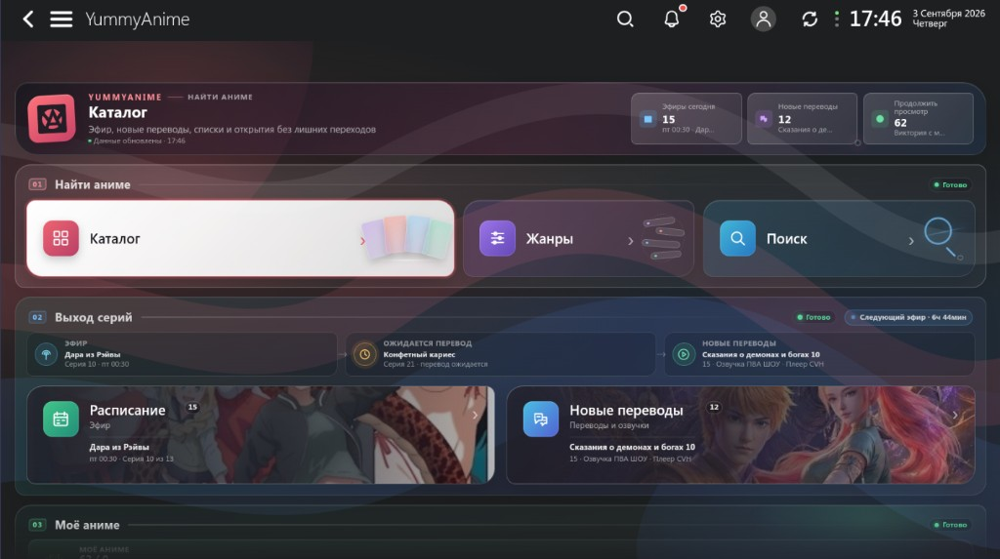
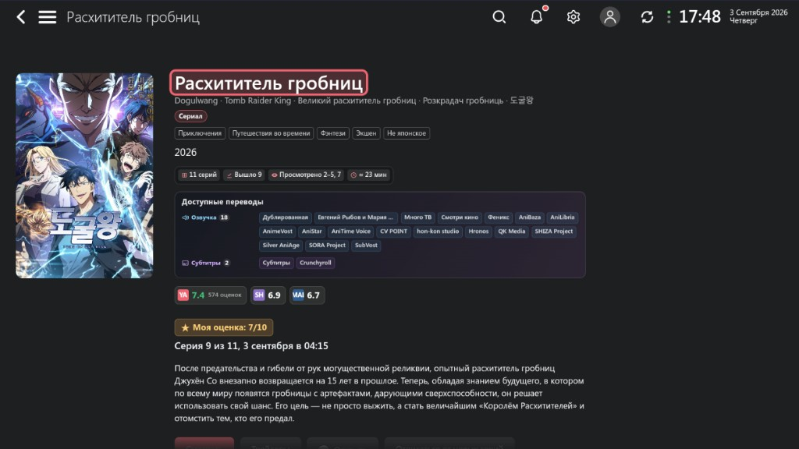
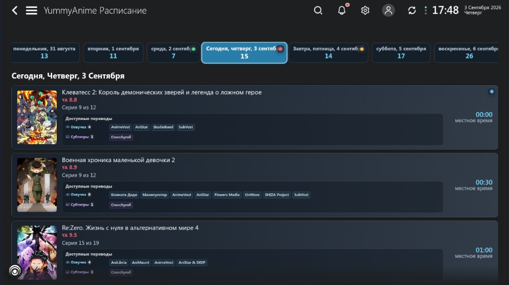
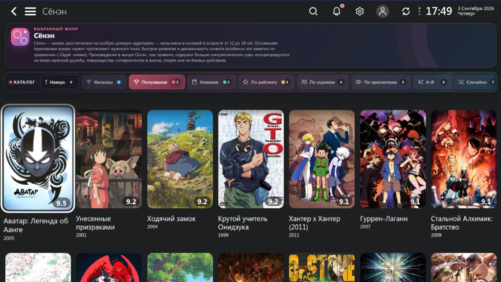

# YummyAnime for Lampa

Официальный плагин YummyAnime для Lampa. Добавляет каталог аниме, расписание, рейтинги, личные списки и просмотр доступных источников. Интерфейс адаптирован для ТВ-пульта.

Текущая версия: `0.46.24`

Официальный сайт: [yummyani.me](https://yummyani.me)

[Основная документация](../README.md) · [История изменений](../CHANGELOG.md)

## Скриншоты

  

  

  

  

## Установка

Добавьте официальную стабильную ссылку в разделе расширений Lampa:

`https://yummyanime.github.io/yummy-lampa-plugin/stable/index.js`

Тестовая версия из `main`:

`https://yummyanime.github.io/yummy-lampa-plugin/dist/index.js`

Для обычного использования выбирайте стабильную версию.

## Авторизация

Зарегистрироваться можно на сайте `https://ru.yummyani.me/`. Для входа в плагин откройте `Настройки → YummyAnime → Войти в YummyAnime` и введите логин или email и пароль от YummyAnime.

После входа доступны профиль, уведомления, оценки, избранное, личные списки и синхронизация прогресса. Пароль не сохраняется. На устройстве хранится Bearer-токен, который расширение обновляет автоматически.

## Основные разделы

- **Каталог** — сортировка и фильтры по типу, статусу и году.
- **Жанры** — список жанров с описаниями и отдельными каталогами.
- **Поиск** — поиск по основным и альтернативным названиям.
- **Коллекции** — тематические подборки YummyAnime.
- **Лучшие** — общий топ, сериалы, фильмы и ONA.
- **Для вас** — новые серии, переводы, новости и связанные произведения для тайтлов из списков и истории.
- **Обновления** — новые события для подписок и личных списков.
- **Продолжить просмотр** — незавершённые тайтлы из истории просмотра.
- **Мои списки** — быстрый доступ к личной библиотеке.
- **Аккаунт** — профиль, статистика и синхронизация.
- **Статус** — доступность сервисов YummyAnime.

Ненужные разделы можно скрыть в настройках расширения.

## Расписание

Расписание открывается на текущем дне и охватывает предыдущую неделю, текущую неделю и две следующие. Для выхода показываются номер серии, местное время, рейтинг и доступные команды озвучки или субтитров.

Отключённые источники не показываются. VK по умолчанию включён: поддерживаемые страницы-обёртки VK преобразуются в прямой MP4/HLS-поток. CVH преобразуется в прямые MP4-качества и по умолчанию включён на Android, Android TV и LG WebOS, где воспроизведение проверено; на остальных платформах он остаётся выключенным из-за отсутствия CORS у CVH API. Alloha по умолчанию выключен. Последнее успешно загруженное расписание доступно и при временном сбое API.

## Рейтинги

Расширение показывает доступные оценки YummyAnime, Kinopoisk, Shikimori, AniDB, MyAnimeList и World-Art. Для экономии места используются логотипы сервисов.

Авторизованный пользователь может поставить оценку YummyAnime от 1 до 10 или удалить её. Рейтинги и кнопку YummyAnime на обычной карточке Lampa можно отключить отдельно.

## Списки

Доступны списки **Смотрю**, **В планах**, **Просмотрено**, **Брошено**, **Отложено** и **Любимое**.

У тайтла может быть только один основной статус. **Любимое** работает независимо от него. Состояние можно изменить на странице тайтла.

Раздел **Мои списки** показывает последние добавленные тайтлы и открывает полные списки. **Продолжить просмотр** объединяет локальную историю и прогресс YummyAnime. Автоматическую синхронизацию можно включить в настройках или запустить вручную на странице аккаунта.

## Воспроизведение и источники типа Alloha

Внутреннему плееру Lampa и внешним Android-плеерам нужна прямая ссылка на видеопоток — обычно HLS (`.m3u8`), DASH, MP4 или WebM. Большинство источников может предоставить такую ссылку. Источники типа Alloha могут вместо неё вернуть защищённый веб-плеер (iframe). Это веб-страница, а не видеофайл: если передать её в Lampa, VLC, Kodi или другой плеер, появится ошибка либо чёрный экран.

Для Alloha расширение использует такой порядок:

1. **Сервер YummyAnime resolver** — превращает выбранную серию и озвучку в прямой HLS-поток.
2. **Сервер Lampac** — пытается найти прямой поток по внешним ID тайтла; совпадение находится не всегда.
3. **Веб-плеер источника Alloha** — необязательный запасной вариант, по умолчанию выключен. Оригинальный веб-плеер открывается внутри Lampa без дополнительного приложения, поэтому таймлайн Lampa, точное отслеживание прогресса и передача во внешний плеер недоступны.

Если доступны и прямой resolver, и веб-плеер источника, расширение предлагает выбрать плеер Lampa либо веб-плеер Alloha. Автопереход продолжает использовать прямой поток без нового диалога. Если ничего из этого не настроено, расширение показывает понятное предупреждение и не передаёт iframe несовместимому плееру. Другие доступные источники продолжают работать и располагаются выше в списке озвучек. Адреса resolver и Lampac, видимость источников, веб-режим Alloha и предпочитаемый плеер настраиваются в разделе `Настройки → YummyAnime`.

Необязательная интеграция с YummyTV доступна только на Android TV и по умолчанию выключена. Она только открывает тайтл в отдельно установленном приложении YummyTV, не является resolver для Alloha и не нужна для остальных функций расширения.

## Дополнительно

- Языки интерфейса: русский, английский и украинский.
- Воспроизведение зависит от доступных источников и их формата.

Официальный плагин YummyAnime
